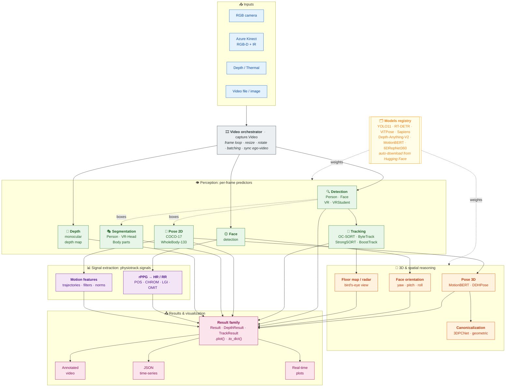

<div align="center">

# Physiotrack

**Contactless human understanding: turning pixels into interpretable physiological and behavioral signals.**

[](https://www.gnu.org/licenses/gpl-3.0)
[](https://www.python.org/downloads/release/python-380/)
[](https://pytorch.org/)


[Why Physiotrack](#why-physiotrack) ·
[Architecture](#architecture) ·
[Install](#installation) ·
[Quick start](#quick-start) ·
[Subsystems](#subsystem-guide) ·
[Models](#model-registry) ·
[Citations](#citations)

</div>

---

**Physiotrack** is an open-source Python toolkit for contactless human understanding. It integrates
state-of-the-art computer-vision models (YOLO11, RT-DETR, ViTPose, Sapiens, Depth-Anything-V2,
MotionBERT, 6DRepNet360) into a **single, unified API** that extracts actionable, theory-linked
signals from RGB / RGB-D / thermal video, for healthcare, education, XR, and operator-support
systems. Developed at the **Center for Machine Vision and Signal Processing (CMVS), University of Oulu**.


## Why Physiotrack?

Foundational models are good at labeling *what* they see. Physiotrack is designed to help systems
understand *what it means*. It converts RGB / Depth / Thermal streams into interpretable
human-state features: pose and motion patterns, posture symmetry, head orientation and gaze
stability, and rPPG-derived heart-rate / respiration-rate candidates.

The philosophy is simple: **"send meaning, not pixels"**, so downstream AI agents can reason about
human *states* instead of processing raw video.

---

## Table of Contents

- [Architecture](#architecture)
- [Key Features](#key-features)
- [Installation](#installation)
- [Quick Start](#quick-start)
- [The Unified API](#the-unified-api)
- [Subsystem Guide](#subsystem-guide)
- [Model Registry](#model-registry)
- [Result Objects](#result-objects)
- [Project Layout](#project-layout)
- [Citations](#citations)
- [Contributing](#contributing)
- [License](#license)
- [Authors & Acknowledgments](#authors)

---

## Architecture

Physiotrack is organized into **independent, composable subsystems**. Each one works standalone
through the same `predict()` API, and the `Video` orchestrator wires them into an end-to-end
pipeline. Every neural backend is resolved on demand through the **`Models` registry**, which
auto-downloads weights from Hugging Face.



**Reading the diagram:** solid arrows are the data flow through a frame; dotted arrows show
detection boxes feeding pose/segmentation and weights flowing in from the registry. Any subsystem
can be used on its own; you don't have to run the whole pipeline.

---

## Key Features

| Subsystem | What it does | Backends |
|-----------|--------------|----------|
| **Detection** | Multi-person / object boxes with confidences | YOLO11, RT-DETR, VR-specific |
| **Tracking** | Persistent IDs across frames, occlusion-robust | OC-SORT, ByteTrack, StrongSORT, BoostTrack |
| **Pose 2D** | Body keypoints (17 COCO or 133 whole-body) | ViTPose, Sapiens, YOLO11-Pose |
| **Pose 3D** | Lift 2D keypoints to 3D over time | MotionBERT, DDHPose |
| **Canonicalization** | Viewpoint-invariant 3D pose alignment | 3DPCNet, geometric |
| **Segmentation** | Pixel-level instance masks | YOLO-Seg, Sapiens, VR-Head |
| **Depth** | Monocular dense depth estimation | Depth-Anything-V2 (s/b/l) |
| **Face** | Face detection + 3D head orientation | YOLO-Face, 6DRepNet360, CMVS-FO-VR |
| **Signals** | rPPG (HR/RR) + motion features | POS, CHROM, LGI, OMIT + filters |
| **Views** | Bird's-eye floor map, ego-video & depth overlays | n/a |

**Inputs:** monocular RGB, RGB-D + infrared (Azure Kinect), depth, and thermal video; live cameras,
files, or single images. **Hardware:** CPU or CUDA GPU (acceleration recommended for real-time use).

---

## Installation

```bash
git clone https://github.com/tharindu326/physiotrack.git
cd physiotrack
pip install -e .
```

> **PyTorch:** install the build that matches your platform/CUDA first. `requirements.txt` pins a
> CUDA 12.8 build (`torch==2.9.1`); adjust the index URL for your setup or for CPU-only.

Model weights are **not** bundled; they download automatically on first use through the
[`Models` registry](#model-registry) (Ultralytics weights via `ultralytics`, everything else from
Hugging Face).

---

## Quick Start

```python
import cv2
import physiotrack as pt

frame = cv2.imread("frame.png")

# Detect people
det    = pt.Detection.Person(conf=0.25, device=0)
result = det.predict(frame)          # -> Result
cv2.imwrite("out.png", result.plot())

# Whole-body 2D pose (auto-detects people if no boxes given)
pose   = pt.Pose.Person()
people = pose.predict(frame)
wrist  = people[0].keypoints.by_name("left_wrist")
print(wrist.x, wrist.y, wrist.confidence)
```

---

## The Unified API

Every image predictor (`Detection`, `Pose`, `Segmentation`, `Depth`, `Face`) follows the
**same pattern** (modeled on Ultralytics / MediaPipe / scikit-learn):

```python
model  = pt.Detection.Person(conf=0.25, iou=0.45, device=0)   # 1. configure the MODEL
result = model.predict(image)                                 # 2. predict  (or: model(image))
data   = result.boxes                                         # 3. read structured data
frame  = result.plot()                                        # 4. draw the overlay
```

Three rules make the whole library predictable:

1. **One verb.** Every predictor exposes `.predict(img)` and is callable. Batch with a list:
   `predict([img, img, ...]) -> list[Result]`.
2. **One return type.** Every predictor returns a rich [`Result`](#result-objects) object, not
   tuples in mixed orders.
3. **Rendering lives on the result, not the model.** `result.plot(...)` draws the overlay;
   constructors only configure the model.

---

## Subsystem Guide

<details open>
<summary><b>Detection</b></summary>

```python
from physiotrack import Detection, Models

det = Detection.Person()                       # also .Face() .VR() .VRStudent()
result = det.predict(image)
print(result.boxes)                            # (N, 4)
for inst in result:
    print(inst.box, inst.confidence, inst.cls_name)

det = Detection.Custom(model=Models.Detection.YOLO.VR.m_vr)   # custom weights
```
</details>

<details>
<summary><b>Pose estimation (2D)</b></summary>

```python
from physiotrack import Pose, Models

pose = Pose.Person()                           # or Pose.VRStudent(), Pose.Custom(model=...)
result = pose.predict(image)                   # auto-detects people if no boxes given
print(result.architecture)                     # "WHOLEBODY" or "COCO"

for person in result:
    wrist = person.keypoints.by_name("left_wrist")
    if wrist:
        print(wrist.x, wrist.y, wrist.confidence)

pose = Pose.Custom(model=Models.Pose.ViTPose.WholeBody.l_wholebody)
```

- **COCO**: 17 keypoints (body only). **WholeBody**: 133 keypoints (body + hands + face).
- When no bounding boxes are supplied, the pose estimator detects people with the default detector.
</details>

<details>
<summary><b>Pose 3D &amp; canonicalization</b></summary>

```python
from physiotrack import Pose3D, canonicalize_pose, Models

p3d = Pose3D(model=Models.Pose3D.MotionBERT.mb_ft_h36m_global_lite, device="cpu")
frames_data, poses_3d = p3d.predict(pose_json, video_path)   # operates on 2D-pose JSON + video

# Viewpoint-invariant canonical form (3DPCNet or geometric)
canonical = canonicalize_pose(poses_3d, view="front")
```
</details>

<details>
<summary><b>Segmentation, Depth, Face</b></summary>

```python
from physiotrack import Segmentation, Depth, VRFace, FaceOrientation, Models

seg = Segmentation.Person()
seg_map = seg.predict(image).seg_map           # (H, W) class map

depth = Depth.DepthAnythingV2Base()
d = depth.predict(image)
raw, colored = d.depth, d.plot(colormap="inferno")

face = VRFace()
boxes = face.predict(image).boxes
orient = FaceOrientation(model=Models.Pose3D.FaceOrientation.VR)
for inst in orient.predict(image, boxes):
    print(inst.orientation)                    # {"yaw": .., "pitch": .., "roll": ..}
```
</details>

<details>
<summary><b>Signals: rPPG &amp; motion</b></summary>

```python
from physiotrack.signals import POS, CHROM, LGI, OMIT, bandpass_filter
from physiotrack.signals import RealTimePlotter, KeypointMotionPlotter

pulse = POS(fps=30).apply(rgb_signal)          # rPPG → blood-volume-pulse candidate
clean = bandpass_filter(pulse, low=0.7, high=4.0, fs=30)
```

Also includes normalization utilities and signal-evaluation metrics
(`compute_rmse`, `calculate_pearson_correlation`, `calculate_dtw_distance`, …).
</details>

<details>
<summary><b>Tracking &amp; full video pipeline</b></summary>

```python
from physiotrack import Tracker, TrackerConfig, Video, Pose, Detection, Models

tracker = Tracker(config=TrackerConfig(tracker="ocsort", classes=[0]))

video = Video(
    source="input.mp4",
    detector=Detection.Person(),
    pose=Pose.Custom(model=Models.Pose.ViTPose.WholeBody.b_wholebody),
    tracker=tracker,
    output_dir="output",
)
data = video.run(output_video="out.mp4", output_json="out.json")
```

The `Video` orchestrator also accepts `segmenter=`, `depth=`, `face=`, `face_orientation=`,
`floor_map=` (radar view), and `ego_video=` to compose any subset of the pipeline.
</details>

---

## Model Registry

All weights are addressed through the `Models` registry and auto-downloaded on first use:

```python
from physiotrack import Models

Models.Detection.YOLO.FACE.m_face           # YOLO face detector
Models.Detection.RTDETR.PERSON.x_person     # RT-DETR person detector
Models.Pose.ViTPose.WholeBody.b_wholebody   # ViTPose whole-body
Models.Pose.Sapiens.WholeBody.B1_TS_COCOHB  # Sapiens whole-body
Models.Depth.DepthAnythingV2.vitb           # Depth-Anything-V2 base
Models.Pose3D.MotionBERT.mb_ft_h36m         # MotionBERT 3D lifter
Models.Pose3D.Canonicalizer.Models._3DPCNetS2   # 3DPCNet pose canonicalizer
Models.Pose3D.FaceOrientation.VR            # CMVS-FO-VR head-orientation
```

### Pose framework comparison

| Framework  | Variants         | Keypoints | Notes                                  |
|------------|------------------|-----------|----------------------------------------|
| YOLO-Pose  | COCO             | 17        | Fast, integrated detection + pose      |
| ViTPose    | COCO, WholeBody  | up to 133 | Transformer-based, high accuracy       |
| Sapiens    | WholeBody        | 133       | State-of-the-art whole-body estimation |

### Model formats

- **Sapiens**: TorchScript `.pt2` (optimized inference)
- **ViTPose**: PyTorch `.pth` weights + matching config
- **YOLO / RT-DETR**: native format with built-in config

---

## Result Objects

| Task | Returns | Key attributes |
|------|---------|----------------|
| detect / pose / segment / face | `Result` | `.boxes`, `.instances`, `.keypoints`, `.seg_map`, `.architecture`, `.plot()`, `.to_dict()` |
| depth | `DepthResult` | `.depth`, `.normalized()`, `.plot(colormap=...)` |
| track | `TrackResult` | `.instances`, `.ids`, `.boxes`, `.plot(frame)` |

Each `Instance` exposes `.id`, `.box`, `.confidence`, `.cls` / `.cls_name`, `.keypoints`
(a `Keypoints` collection with `.by_name()` / `.by_id()`), `.mask`, and `.orientation` as
applicable. `Keypoints` also offers the array views `.xy`, `.xyz`, and `.conf`.

---

## Project Layout

```
src/physiotrack/
├── capture/        # Video orchestrator (end-to-end pipeline)
├── detect/         # Detection
├── pose/           # Pose 2D, Pose3D, canonicalizer, evaluation
├── segment/        # Segmentation
├── depth/          # Depth estimation
├── face/           # Face detection + orientation
├── trackers/       # OC-SORT, ByteTrack, StrongSORT, BoostTrack
├── signals/        # rPPG (POS/CHROM/LGI/OMIT), motion, filters, plotting
├── core/           # inference loop, radar/floor view, ego view, depth view
├── modules/        # Neural backends (ViTPose, Sapiens, YOLO, DepthAnythingV2,
│                   #   MotionBERT, DDHPose, 3DCPNet, 6DRepNet360)
├── results.py      # Unified Result / DepthResult / TrackResult / Instance / Keypoints
└── models.py       # Models registry + Hugging Face auto-download
```

See [`examples/`](examples/) for runnable scripts covering each subsystem, and
[`docs/API_REDESIGN.md`](docs/API_REDESIGN.md) for the full public-API specification.

---

## Citations

If you use Physiotrack in your research, please cite the relevant papers:

```bibtex
@inproceedings{ekanayake2025evaluating,
  title={Evaluating the Accuracy and Reliability of Camera-Based Physiological and Motion Signal Extraction Techniques in Virtual Reality Training Environments},
  author={Ekanayake, Tharindu and {\'A}lvarez Casado, Constantino and Nguyen, Nhi and Sobocinski, Marta and Pramila-Savukoski, Sari and Wu, Xiaoting and Mikkonen, Kristina and Bordallo L{\'o}pez, Miguel},
  booktitle={Scandinavian Conference on Image Analysis},
  pages={442--456},
  year={2025},
  organization={Springer}
}

@inproceedings{ekanayake20263dpcnet,
  title={3DPCNet: Pose Canonicalization for Robust Viewpoint-Invariant 3D Kinematic Analysis from Monocular RGB Cameras},
  author={Ekanayake, Tharindu and Casado, Constantino {\'A}lvarez and L{\'o}pez, Miguel Bordallo},
  booktitle={ICASSP 2026-2026 IEEE International Conference on Acoustics, Speech and Signal Processing (ICASSP)},
  pages={11007--11011},
  year={2026},
  organization={IEEE}
}

@article{casado2023face2ppg,
  title={Face2PPG: An unsupervised pipeline for blood volume pulse extraction from faces},
  author={Casado, Constantino Alvarez and L{\'o}pez, Miguel Bordallo},
  journal={IEEE Journal of Biomedical and Health Informatics},
  volume={27},
  number={11},
  pages={5530--5541},
  year={2023},
  publisher={IEEE}
}

@inproceedings{nguyen2025comparative,
  title={Comparative Analysis of rPPG and Motion-Based Approaches for Heart and Respiration Rate Estimation from Videos},
  author={Nguyen, Nhi and {\'A}lvarez Casado, Constantino and Nguyen, Le and Lage Ca{\~n}ellas, Manuel and Bordallo L{\'o}pez, Miguel},
  booktitle={Scandinavian Conference on Image Analysis},
  pages={32--46},
  year={2025},
  organization={Springer}
}
```

---

## Contributing

Physiotrack is an open-source project and welcomes contributions: new models, documentation,
bug fixes, or examples. Please open an issue or pull request on
[GitHub](https://github.com/tharindu326/physiotrack).

---

## License

Licensed under the **GNU General Public License v3.0**. See the [LICENSE](LICENSE) file for details.

---

## Authors

**Developed by**
- M.Sc. Tharindu Ekanayake
- D.Sc. (Tech) Constantino Álvarez Casado *(PI)*

**Affiliation**
Multimodal Sensing Lab (MMSLab) · Center for Machine Vision and Signal Processing (CMVS) ·
University of Oulu, Finland

### Acknowledgments

This research was supported by the University of Oulu and the Research Council of Finland
(former Academy of Finland) through the 6G Flagship Programme (Grant No. 346208), the Profi5 HiDyn
programme (326291), and the Profi7 Hybrid Intelligence programme (352788). The authors acknowledge
CSC (IT Center for Science, Finland) for computational resources.

---

<div align="center">

**Repository:** [github.com/tharindu326/physiotrack](https://github.com/tharindu326/physiotrack)

</div>
