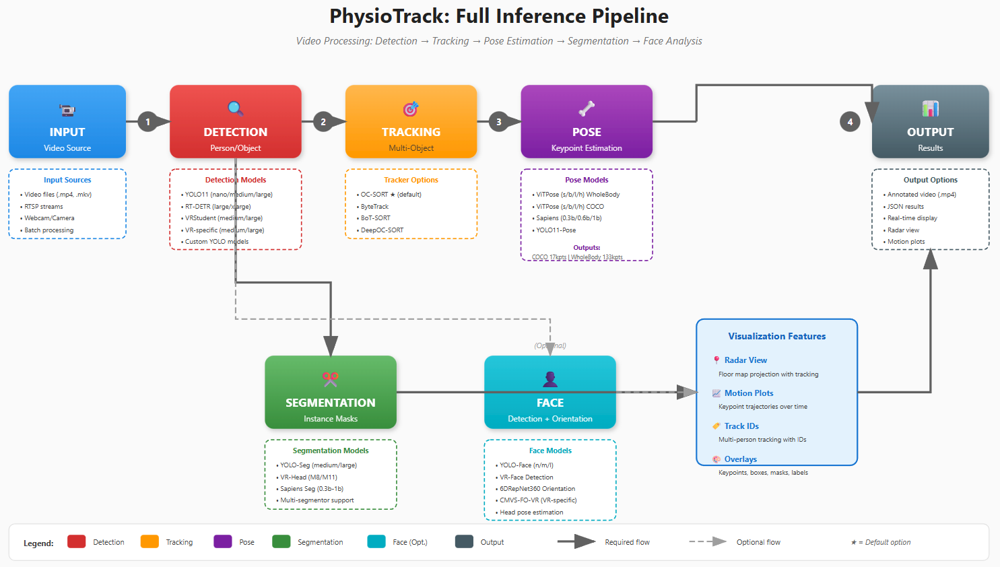

# Physiotrack

[](https://www.gnu.org/licenses/gpl-3.0)
[](https://www.python.org/downloads/release/python-380/)


**Physiotrack** is an open-source Python toolkit for contactless human understanding, transforming pixels into interpretable physiological and behavioral cues. Developed at the University of Oulu, it integrates state-of-the-art computer vision models (YOLO, RT-DETR, Sapiens, ViTPose) into modular pipelines that extract actionable, theory-linked signals for applications in healthcare, education, XR environments, and operator support systems.

## Why Physiotrack?

While foundational models excel at labeling what they see, Physiotrack is designed to help systems understand what it means. It converts RGB/Depth/Thermal video streams into interpretable human-state features such as blink rate, gaze stability, posture symmetry, motion patterns, and rPPG-derived heart rate and respiration rate candidates. The philosophy is simple: **"send meaning, not pixels"** — enabling downstream AI agents to reason about human states rather than processing raw video data.


---

## Key Features

### Input Devices
- External RGB cameras (Azure Kinect) providing RGB-D and infrared streams
- Support for monocular RGB, depth, and thermal video inputs

### Core Capabilities
- **Real-time Detection & Tracking**: Multi-person detection and tracking with persistent IDs
- **Pose Estimation**: 2D body keypoint extraction with support for whole-body (133 keypoints) and standard COCO (17 keypoints) formats
- **Motion Analysis**: Trajectory visualization and motion pattern extraction
- **Instance Segmentation**: Body and VR headset mask generation
- **Floor Mapping**: Bird's-eye view spatial analysis with customizable backgrounds
- **Face Analysis**: Face detection and 3D head orientation estimation
- **6DOF VR Tracking**: External tracking of VR headset poses

### Offline Post-Processing
- Integration with advanced depth estimation models (e.g., Depth Anything v2)
- Compatible with both egocentric and external video recordings

---

## Architecture Overview



Physiotrack consists of multiple interconnected modules that can be used independently or combined into comprehensive processing pipelines:

### 🔍 Detection Module
Detects persons and objects in each video frame with high accuracy and speed.

**Features:**
- Multiple detection backends: YOLO11, RT-DETR, VRStudent (VR-specific)
- Outputs bounding boxes with confidence scores
- Support for custom-trained detection models
- GPU-accelerated inference (CUDA-enabled)

**Supported Detection Classes:**
- Person detection (general scenes)
- Face detection
- VR headset and VR-equipped student detection

### 🎯 Tracking Module
Maintains consistent identity assignment across frames, enabling longitudinal analysis.

**Features:**
- Persistent ID assignment for detected persons
- Robust handling of occlusions and re-identification
- Multiple tracking algorithms: OC-SORT (default), ByteTrack, BoT-SORT, DeepOC-SORT
- Multi-person tracking in crowded or dynamic scenes
- Track IDs persist throughout entire video sequences

### 🦴 Pose Estimation Module
Extracts detailed 2D body keypoints for biomechanical and behavioral analysis.

**Model Options:**
- **ViTPose**: Available in s/b/l/h variants (speed vs accuracy trade-off)
- **Sapiens**: High-accuracy models (0.3b/0.6b/1b parameters)
- **YOLO11-Pose**: Fast integrated detection + pose estimation

**Output Formats:**
- **COCO**: 17 keypoints (body only) — suitable for general pose analysis
- **WholeBody**: 133 keypoints (body + hands + face) — comprehensive for gesture and facial expression analysis

**Auto-Detection:** When bounding boxes are not provided, pose estimators automatically detect persons using the default person detector.

### 🎭 Segmentation Module
Generates pixel-level instance masks for fine-grained spatial analysis.

**Features:**
- Runs in parallel with pose estimation for efficiency
- Multiple segmentation models: YOLO-Seg, VR-Head (VR headset-specific), Sapiens
- Simultaneous multi-class segmentation (e.g., Person + VR-Head)
- Essential for background separation and occlusion analysis

### 😊 Face Module (Optional)
Provides facial analysis capabilities for attention and engagement assessment.

**Components:**
- **Face Detection**: Locates faces using YOLO-Face or VR-Face models
- **Face Orientation**: Estimates 3D head pose (yaw, pitch, roll angles)
- **Orientation Models**: 6DRepNet360, CMVS-FO-VR (optimized for VR scenarios)

**Applications:** Attention tracking, gaze direction analysis, engagement monitoring

### 🗺️ Floor Mapping / Radar View
Projects tracked persons onto a 2D floor plan for spatial behavior analysis.

**Features:**
- Bird's-eye view visualization of person positions
- Requires 4 corner points defining the floor area in the video frame
- Multiple background options:
  - Default: Black canvas with gray background
  - Auto/Extract: Automatically extracts floor texture from first frame using homography
  - Custom: Load pre-made floor plan images
- Adjustable rotation (0°, 90°, 180°, 270°) to match expected viewpoint
- Real-time position tracking of all detected persons

**Applications:** Movement pattern analysis, spatial distribution studies, room occupancy monitoring

### 📊 Motion Plotting
Tracks and visualizes keypoint trajectories over time for detailed motion analysis.

**Features:**
- Plots movement of specific body parts (e.g., left_wrist, right_elbow)
- Keypoint selection: Any COCO keypoint ID (0-16)
  - Common selections: 9=left_wrist, 10=right_wrist, 15=left_ankle, 16=right_ankle
- Motion calculated relative to pelvis (removes global body translation)
- Signal filtering: Bandpass filter (0.5-5.0 Hz) for smooth visualization
- Real-time scrolling plot displaying recent motion history

**Applications:** Repetitive motion analysis, gesture recognition, exercise form tracking, rehabilitation monitoring

---

## Installation

```bash
pip install -e .
```

> **Note:** Ensure PyTorch is installed for your system. For GPU acceleration, install PyTorch with CUDA support matching your system configuration.

---

## Quick Start Guide

### Model Access

Physiotrack provides a unified interface for accessing all available models:

```python
from physiotrack import Models

# Accessing YOLO face detection model
face_model = Models.Detection.YOLO.FACE.m_face

# Accessing RT-DETR person detection model
rtdetr_model = Models.Detection.RLDETR.PERSON.x_person

# ViTPose WholeBody model
vitpose_model = Models.Pose.ViTPose.WholeBody.b_WHOLEBODY

# Sapiens Pose model
sapiens_model = Models.Pose.Sapiens.WholeBody.B1_TS_COCOHB
```

### Detection Usage

#### Built-in Person Detector
```python
from physiotrack import Detection

# Initialize default person detector
detector = Detection.Person()
results, frame = detector.detect(image)
```

#### Custom Detection Model
```python
from physiotrack import Detection, Models

# Use a custom VR detection model
custom_model = Models.Detection.YOLO.VR.m_VR
custom_detector = Detection.Custom(model=custom_model)
results, frame = custom_detector.detect(image)
```

### Pose Estimation Usage

#### Built-in VRStudent Pose Estimator
```python
from physiotrack import Pose

# Initialize VR-specific pose estimator
pose_estimator = Pose.VRStudent()
pose_image, data = pose_estimator.estimate(image)
```

#### Custom Pose Model
```python
from physiotrack import Pose, Models

# Use ViTPose large model for whole-body estimation
model = Models.Pose.ViTPose.WholeBody.l_WHOLEBODY
pose_estimator = Pose.Custom(model=model)
pose_image, data = pose_estimator.estimate(image)
```

#### Auto-Detection Integration
If no bounding boxes are provided, ViTPose and Sapiens estimators automatically detect people:

```python
# Automatically detects person bounding boxes before pose estimation
pose_image, data = pose_estimator.estimate(image)
```

---

## Supported Models

### Pose Estimation Frameworks

| Framework  | Variants         | Keypoints | Description                           |
|-----------|------------------|-----------|---------------------------------------|
| YOLO-Pose | COCO            | 17        | Fast integrated detection + pose      |
| ViTPose   | COCO, WholeBody | Up to 133 | Transformer-based, high accuracy      |
| Sapiens   | WholeBody       | 133       | State-of-the-art whole-body estimation|

---

## Key Technical Concepts

- **ValidatedDetector**: Ensures model compatibility with intended detection class, preventing mismatched model usage
- **PoseBase**: Abstract base class unifying pose estimation across different frameworks (ViTPose, YOLO-Pose, Sapiens)
- **Modular Design**: All components support configurable `device`, `confidence`, `NMS`, and rendering options
- **Extensibility**: Detection and Pose classes can be extended for custom models and new detection/pose estimation approaches

---

## Model Formats

- **Sapiens**: TorchScript `.pt2` format for optimized inference
- **ViTPose**: PyTorch `.pth` weights requiring compatible configuration files
- **YOLO**: Native YOLO format with built-in configuration

---

## Citations

If you use Physiotrack in your research, please cite the relevant papers:

```bibtex
@inproceedings{ekanayake2025evaluating,
  title={Evaluating the Accuracy and Reliability of Camera-Based Physiological and Motion Signal Extraction Techniques in Virtual Reality Training Environments},
  author={Ekanayake, Tharindu and {\'A}lvarez Casado, Constantino and Nguyen, Nhi and Sobocinski, Marta and Pramila-Savukoski, Sari and Wu, Xiaoting and Mikkonen, Kristina and Bordallo L{\'o}pez, Miguel},
  booktitle={Scandinavian Conference on Image Analysis},
  pages={442--456},
  year={2025},
  organization={Springer}
}

@inproceedings{ekanayake20263dpcnet,
  title={3DPCNet: Pose Canonicalization for Robust Viewpoint-Invariant 3D Kinematic Analysis from Monocular RGB Cameras},
  author={Ekanayake, Tharindu and Casado, Constantino {\'A}lvarez and L{\'o}pez, Miguel Bordallo},
  booktitle={ICASSP 2026-2026 IEEE International Conference on Acoustics, Speech and Signal Processing (ICASSP)},
  pages={11007--11011},
  year={2026},
  organization={IEEE}
}

@article{casado2023face2ppg,
  title={Face2PPG: An unsupervised pipeline for blood volume pulse extraction from faces},
  author={Casado, Constantino Alvarez and L{\'o}pez, Miguel Bordallo},
  journal={IEEE Journal of Biomedical and Health Informatics},
  volume={27},
  number={11},
  pages={5530--5541},
  year={2023},
  publisher={IEEE}
}

@inproceedings{nguyen2025comparative,
  title={Comparative Analysis of rPPG and Motion-Based Approaches for Heart and Respiration Rate Estimation from Videos},
  author={Nguyen, Nhi and {\'A}lvarez Casado, Constantino and Nguyen, Le and Lage Ca{\~n}ellas, Manuel and Bordallo L{\'o}pez, Miguel},
  booktitle={Scandinavian Conference on Image Analysis},
  pages={32--46},
  year={2025},
  organization={Springer}
}
```

---

## Contributing

Physiotrack is an open-source project welcoming contributions from the community. Whether you want to add new models, improve documentation, or fix bugs, your contributions are appreciated.

---

## License

This project is licensed under the GNU General Public License v3.0 - see the [LICENSE](LICENSE) file for details.

---

## Authors

**Developed by:**
- M.Sc. Tharindu Ekanayake
- D.Sc. (Tech) Constantino Álvarez Casado (PI)

**Affiliation:**  
Multimodal Sensing Lab (MMSLab)  
Center for Machine Vision and Signal Processing (CMVS)  
University of Oulu, Finland

---

## Acknowledgments

The research was supported by the University of Oulu and the Research Council of Finland (former Academy of Finland) through the 6G Flagship Programme (Grant Number: 346208), Profi5 HiDyn programme (326291), and Profi7 Hybrid Intelligence program (352788). The authors acknowledge CSC—IT Center for Science, Finland, for providing computational resources.

---

**Repository:** [https://github.com/tharindu326/physiotrack](https://github.com/tharindu326/physiotrack)
