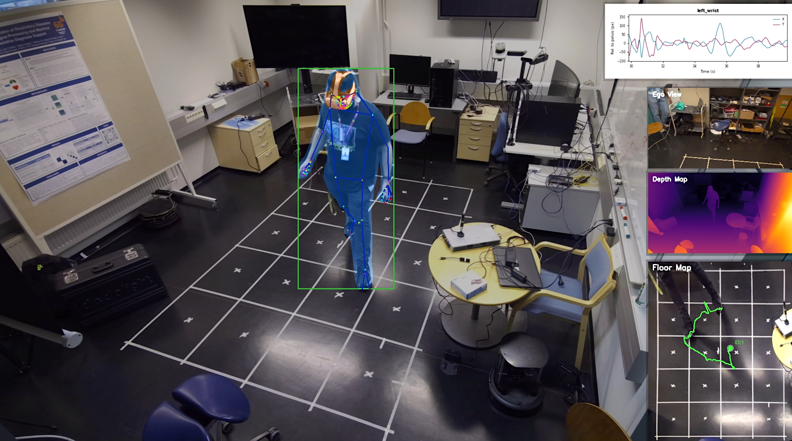
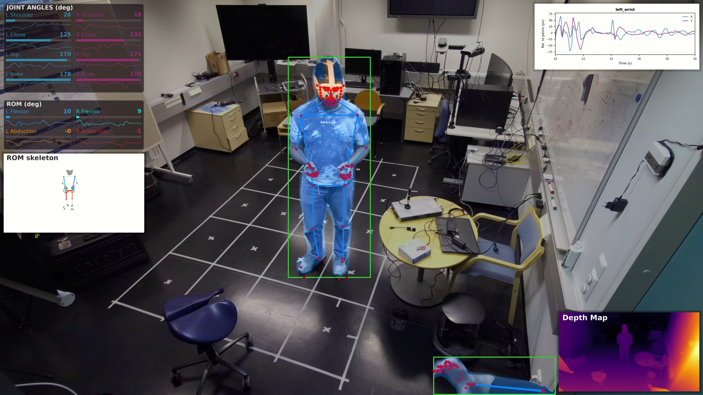
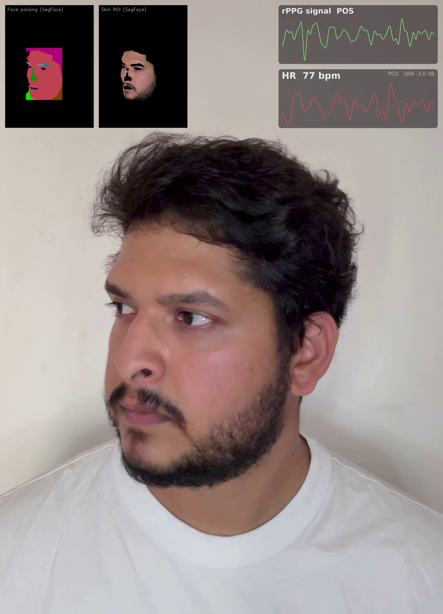

# Physiotrack

**Contactless human understanding from RGB video — one unified API.**

Physiotrack turns ordinary monocular RGB video into interpretable human-state
signals: person and face **detection**, 2D and 3D **pose**, instance and face-part
**segmentation**, monocular **depth**, **head orientation / gaze**, multi-object
**tracking**, and physiological / motion **signals** (rPPG heart rate, joint angles,
clinical range-of-motion). Every subsystem works standalone through the same
`.predict()` call, and the [`Video`][physiotrack.Video] orchestrator wires them into
an end-to-end pipeline.

[](https://youtu.be/DFVYfZCk3t4)

<div class="grid" markdown>

[:octicons-rocket-24: **Get Started**](getting-started/index.md){ .md-button .md-button--primary }
[:material-book-open-variant: **API Reference**](api/index.md){ .md-button }
[:material-package-variant-closed: **Model Zoo**](model-zoo.md){ .md-button }

</div>

---

## Install

```bash
git clone https://github.com/tharindu326/physiotrack.git
cd physiotrack
pip install -e .
```

Model weights are **not** bundled — they auto-download from Hugging Face (and
Ultralytics) on first use. See the [Installation guide](getting-started/installation.md)
for PyTorch/CUDA setup and the optional video codec.

## 30-second quickstart

```python
import cv2
import physiotrack as pt

frame = cv2.imread("frame.png")

# 1. Detect people
det = pt.Detection.Person(conf=0.25, device="cpu")
result = det.predict(frame)                 # -> pt.Result
cv2.imwrite("boxes.png", result.plot())

# 2. Whole-body 2D pose (auto-detects people if no boxes given)
pose = pt.Pose.Person()
people = pose.predict(frame)
wrist = people[0].keypoints.by_name("left_wrist")
print(wrist.x, wrist.y, wrist.confidence)
```

Every predictor follows the same four-step rhythm — **configure the model →
`predict()` → read structured data → `plot()`**. Learn it once in
[Core Concepts](getting-started/concepts.md).

---

## Capabilities

<div class="grid cards" markdown>

-   :material-crop-free:{ .lg .middle } **Detection**

    ---

    Person, face and VR-scene object boxes with YOLO11 / RT-DETR.

    [:octicons-arrow-right-24: Detection guide](guides/detection.md)

-   :material-run-fast:{ .lg .middle } **Pose (2D)**

    ---

    Top-down 2D keypoints — COCO-17 or WholeBody-133 (ViTPose · Sapiens · YOLO11-Pose).

    [:octicons-arrow-right-24: Pose guide](guides/pose.md)

-   :material-cube-outline:{ .lg .middle } **Pose 3D**

    ---

    Lift 2D keypoints to 3D over time (MotionBERT · DDHPose) and canonicalize viewpoint.

    [:octicons-arrow-right-24: Pose 3D guide](guides/pose3d.md)

-   :material-select-group:{ .lg .middle } **Segmentation**

    ---

    Instance masks, body parts, VR-head and 19-class face parsing (YOLO-Seg · Sapiens · SegFace).

    [:octicons-arrow-right-24: Segmentation guide](guides/segmentation.md)

-   :material-image-filter-hdr:{ .lg .middle } **Depth**

    ---

    Dense monocular relative depth with Depth-Anything-V2 (S / B / L).

    [:octicons-arrow-right-24: Depth guide](guides/depth.md)

-   :material-face-recognition:{ .lg .middle } **Face & Orientation**

    ---

    Face detection plus 3D head orientation (yaw / pitch / roll) via 6DRepNet360.

    [:octicons-arrow-right-24: Face guide](guides/face.md)

-   :material-target:{ .lg .middle } **Tracking**

    ---

    Persistent IDs across frames — OC-SORT · ByteTrack · StrongSORT · BoostTrack.

    [:octicons-arrow-right-24: Tracking guide](guides/tracking.md)

-   :material-movie-play:{ .lg .middle } **Video pipeline**

    ---

    One orchestrator composing any subset of the stages end-to-end.

    [:octicons-arrow-right-24: Video guide](guides/video.md)

-   :material-heart-pulse:{ .lg .middle } **Signals**

    ---

    rPPG heart rate, joint angles and clinical ROM, motion features.

    [:octicons-arrow-right-24: Signals guide](guides/signals.md)

</div>

---

## Example outputs



*Full pipeline on a single frame: tracked whole-body pose, instance / VR-head
segmentation, live joint-angle and clinical-ROM panels, the ROM skeleton, a
wrist-motion plot, and colorized monocular depth.*



*Contactless rPPG: a single SegFace pass yields the face parsing and skin ROI that
drive the live blood-volume-pulse signal and the derived heart rate.*

---

!!! info "Inputs & hardware"
    Physiotrack consumes **monocular RGB** (BGR frames via OpenCV) — video files,
    RTSP streams, live cameras, or single images. Depth is *estimated* monocularly,
    not sensed. Runs on **CPU** (`device="cpu"`) or a **CUDA GPU** (`device=0` /
    `device="cuda"`); GPU acceleration is recommended for real-time use.

!!! quote "Design philosophy"
    **Send meaning, not pixels.** Physiotrack converts raw video into interpretable
    human-state features so downstream systems reason about *states*, not frames.
    Developed at the Center for Machine Vision and Signal Processing (CMVS),
    University of Oulu.

## Where to next

- **New here?** Start with [Installation](getting-started/installation.md) →
  [Quickstart](getting-started/quickstart.md) → [Core Concepts](getting-started/concepts.md).
- **Task guides:** the [Guides](guides/index.md) section teaches each subsystem.
- **Every symbol:** the [API Reference](api/index.md) is generated from source.
- **Weights & presets:** browse the [Model Zoo](model-zoo.md).
